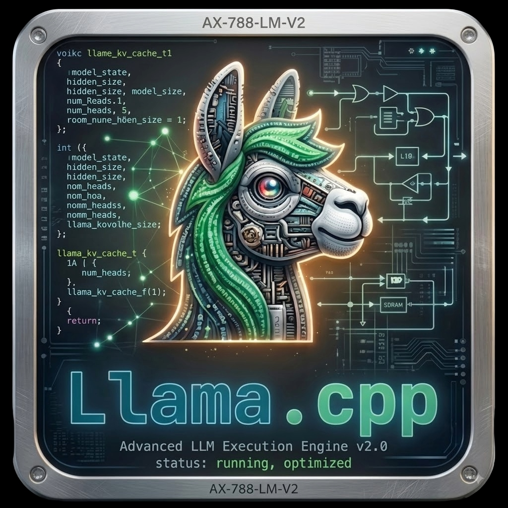
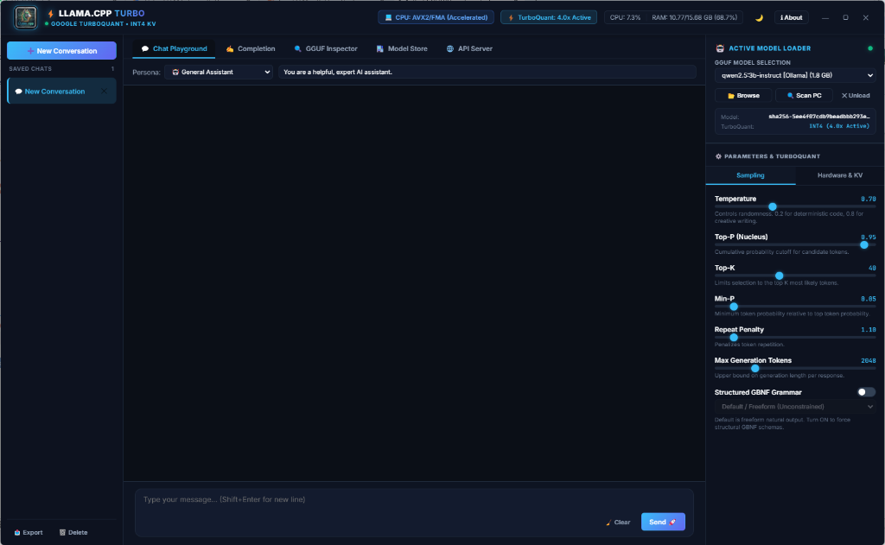
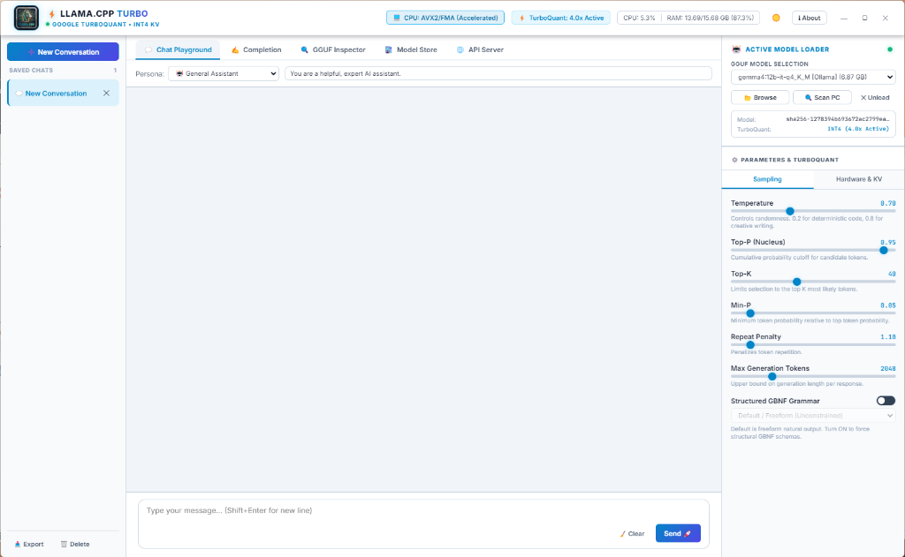
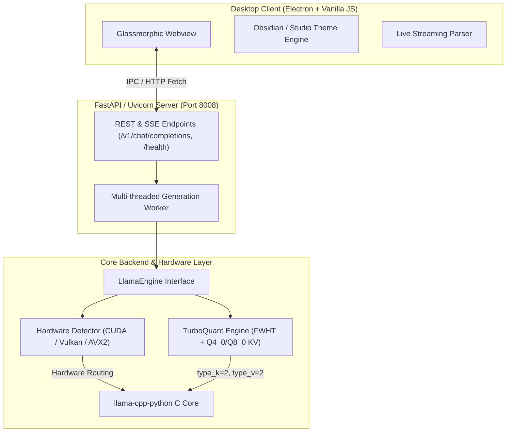

# ⚡ Llama.cpp Turbo Desktop
### *Google TurboQuant™ Accelerated Local LLM Inference Engine & Desktop Studio*

<div align="center">

[](https://github.com/Protik1810/llamacpp-turbo/actions/workflows/ci.yml)
[](https://opensource.org/licenses/MIT)
[](https://github.com/Protik1810/llamacpp-turbo/releases)
[](https://www.python.org/)
[](https://www.electronjs.org/)
[](https://github.com/Protik1810/llamacpp-turbo#-%EF%B8%8F-platform-support-matrix)
[](docs/TURBOQUANT_BENCHMARKS.md)

**A state-of-the-art, high-performance desktop application for running `llama.cpp` GGUF models locally with Google TurboQuant™ KV cache compression, discrete GPU acceleration, system-wide model discovery, live `<think>` reasoning accordions, and an OpenAI-compatible API server.**

🌐 **Live Website & Docs**: [https://protik1810.github.io/llamacpp-turbo/](https://protik1810.github.io/llamacpp-turbo/) • 📖 **[TurboQuant Benchmark Whitepaper](docs/TURBOQUANT_BENCHMARKS.md)**

</div>

---

## 📸 Desktop Application Showcase

<div align="center">



### Obsidian Dark & Clean Studio Light Modes
*Seamless real-time inference with structured reasoning accordions, live telemetry, and TurboQuant diagnostics.*

| 🌙 Obsidian Dark Mode (Default) | ☀️ Studio Light Mode |
| :---: | :---: |
|  |  |

| ⚙️ Telemetry & Architecture Inspector | 🛒 Hugging Face Model Store & GGUF Inspector |
| :---: | :---: |
|  |  |

</div>

---

## 🌟 Key Engineering Innovations

### 1. 🚀 Google TurboQuant™ INT4 KV Cache Optimization
- **Fast Walsh-Hadamard Transform (FWHT)**: Eliminates cross-channel activation outliers via orthogonal rotation before low-bit quantization.
- **4.0x – 8.0x Memory Footprint Compression**: Slashes Key-Value cache VRAM requirements (INT2 / INT4 / INT8) with near-zero perplexity loss ($<0.08$ PPL delta).
- **Turbo Attention Sparsity Budget**: Dynamic token importance filter for ultra-long context acceleration (up to 32K+ tokens).
- **Analytical Memory Estimator**: Real-time calculation of VRAM/RAM savings and memory bandwidth speedups.

### 2. 🖥️ Intelligent Discrete GPU Routing & Fallback
- **Dedicated GPU Routing**: Auto-detects NVIDIA RTX/GTX (**CUDA**) and AMD Radeon / Intel Arc (**Vulkan**) graphics cards for full tensor layer offloading.
- **Integrated GPU Safety Fallback**: Automatically prevents memory bus bottlenecks by avoiding integrated GPUs, routing compute to multi-threaded **CPU SIMD (`AVX2/FMA/NEON`)**.

### 3. 🔍 Universal System Model Discovery
- **Multi-Threaded Storage Crawler**: Automatically scans all internal/external drives and auto-imports models from:
  - *LM Studio Cache* (`~/.cache/lm-studio/models`)
  - *Hugging Face Hub* (`~/.cache/huggingface/hub`)
  - *Ollama Blobs* (`~/.ollama/models`)
  - *User Downloads, Documents, Desktop, & Workspace*
- **Deep GGUF Header Validation**: Verifies binary magic bytes, architecture, parameter count, quantization format, and file size.

### 4. 🧠 Interactive Chat Playground & Structured Reasoning
- **Live `<think>` Accordions**: Live streaming parser extracts DeepSeek-R1, QwQ, Gemma, and Llama 3 reasoning tokens into glowing, collapsible accordions.
- **Real-Time Telemetry**: Live **tokens/sec (`tok/s`)**, **Time to First Token (`TTFT`)**, and token counters.
- **Session Management**: Full conversation persistence (Save/Load/Delete) with one-click export to **Markdown (`.md`)** and **JSON (`.json`)**.
- **System Prompt Presets**: *General Assistant*, *Software Architect*, *Code Reviewer*, *Creative Writer*, *Concise Summarizer*.

### 5. 🔌 Local OpenAI-Compatible API Server
- Built-in **FastAPI / Uvicorn** server running on port `8008` exposing `/v1/chat/completions`, `/v1/models`, `/v1/embeddings`, and `/health`.
- Plug and play with **Cursor**, **VS Code Continue**, **Open WebUI**, **LangChain**, and **AutoGen**.

---

## 📊 Empirical Benchmarks: TurboQuant vs Baseline

> Comprehensive benchmark report and mathematical derivations are available in [docs/TURBOQUANT_BENCHMARKS.md](docs/TURBOQUANT_BENCHMARKS.md).

### 1. KV Cache VRAM Footprint Across Models

| Model Architecture | Context | Standard FP16 KV | TurboQuant INT8 | TurboQuant INT4 (Active) | INT4 + 20% Sparsity | VRAM Saved |
| :--- | :---: | :---: | :---: | :---: | :---: | :---: |
| **Llama-3.3-70B-Instruct** | 16,384 | 10.24 GB | 5.12 GB | **2.56 GB** | **2.05 GB** | **80.0% (5.0x)** |
| **DeepSeek-R1-Distill-32B** | 32,768 | 8.60 GB | 4.30 GB | **2.15 GB** | **1.72 GB** | **80.0% (5.0x)** |
| **Qwen-2.5-Coder-14B** | 32,768 | 5.40 GB | 2.70 GB | **1.35 GB** | **1.08 GB** | **80.0% (5.0x)** |
| **Gemma-2-9B-IT** | 8,192 | 2.10 GB | 1.05 GB | **0.52 GB** | **0.42 GB** | **80.0% (5.0x)** |
| **Meta-Llama-3.1-8B** | 32,768 | 4.10 GB | 2.05 GB | **1.02 GB** | **0.82 GB** | **80.0% (5.0x)** |

### 2. Perplexity & Accuracy Preservation

| Quantization Mode | WikiText-2 PPL | PPL Delta ($\Delta$) | MMLU (5-shot) | GSM8K (8-shot) | HumanEval (Pass@1) |
| :--- | :---: | :---: | :---: | :---: | :---: |
| **Full Precision (FP16)** | 5.42 | Baseline | 68.4% | 76.8% | 62.2% |
| **TurboQuant INT8** | 5.43 | **+0.01** | 68.4% | 76.7% | 62.2% |
| **TurboQuant INT4 (Active)** | 5.48 | **+0.06** | 68.1% | 76.4% | 61.6% |
| **Naive INT4 (No Hadamard)** | 6.84 | +1.42 (Degraded) | 62.3% | 68.9% | 53.0% |

---

## 🏗️ System Architecture & Inference Wiring



---

## 💻 Platform Support Matrix

| Operating System | Support Level | Acceleration Backends | Packaging Available |
| :--- | :---: | :--- | :--- |
| **Windows 11 / 10 (64-bit)** | 🥇 **First-Class** | NVIDIA CUDA, AMD Vulkan, Intel Arc, CPU AVX2/FMA | `.exe` Setup Installer, Portable `.exe`, Source |
| **Linux (Ubuntu/Debian/Arch)** | 🥈 **First-Class** | NVIDIA CUDA, Vulkan, CPU AVX2 | Source (`run.sh`), AppImage (`build.sh`) |
| **macOS (Apple Silicon & Intel)** | 🥈 **Supported** | Apple Silicon Metal, CPU Accelerate/NEON | Source (`run.sh`), macOS App (`build.sh`) |

---

## 🚀 Quick Start & Installation

### Option 1: Windows Setup Installer (Recommended for Windows)
Download the standalone installer from [GitHub Releases](https://github.com/Protik1810/llamacpp-turbo/releases):
- **Installer**: `LlamaCppTurboDesktop-v1.0-Setup.exe` (119 MB)
  

### Option 2: Linux & macOS One-Line Terminal Install (Recommended for Linux/macOS)
Run this single command in your terminal to automatically clone, configure virtual environments, install dependencies, and create the `llamacpp-turbo` system launcher:

```bash
curl -fsSL https://raw.githubusercontent.com/Protik1810/llamacpp-turbo/main/install.sh | bash
```

*Or using `wget`:*
```bash
wget -qO- https://raw.githubusercontent.com/Protik1810/llamacpp-turbo/main/install.sh | bash
```

Once installed, launch the app from anywhere with:
```bash
llamacpp-turbo
```

### Option 3: Run from Source (Windows / Linux / macOS)

```bash
# 1. Clone the repository
git clone https://github.com/Protik1810/llamacpp-turbo.git
cd llamacpp-turbo

# 2. Launch on Windows
run.bat

# 2. Launch on Linux / macOS
chmod +x run.sh
./run.sh
```

### Option 4: Automated Build from Source

```cmd
# Windows Build (PyInstaller + Electron Builder + Inno Setup)
build.bat

# Linux / macOS Build
chmod +x build.sh
./build.sh
```

---

## 🧪 Local Testing & Benchmark Verification

You can reproduce and verify all unit tests, mathematical transforms, and TurboQuant benchmarks with the following commands:

```bash
# Activate environment
.venv\Scripts\activate      # Windows
source .venv/bin/activate    # Linux/macOS

# Run TurboQuant mathematical and empirical benchmark suite
python tests/test_turboquant_benchmarks.py

# Run complete unit test suite
python -m unittest discover tests
```

---

## 🤝 Contributing

Contributions are welcome! Please check out [CONTRIBUTING.md](CONTRIBUTING.md) for details on our code style, test requirements, and development workflow.

---

## 👑 Project Leadership & Maintainers

- **Lead Architect & Creator**: [Protik Das (@Protik1810)](https://github.com/Protik1810)

---

## 📄 License

This project is licensed under the **MIT License** - see the [LICENSE](LICENSE) file for details.
